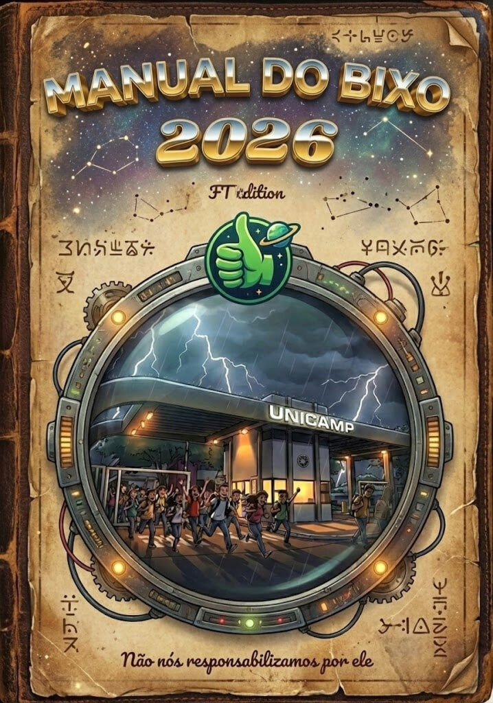
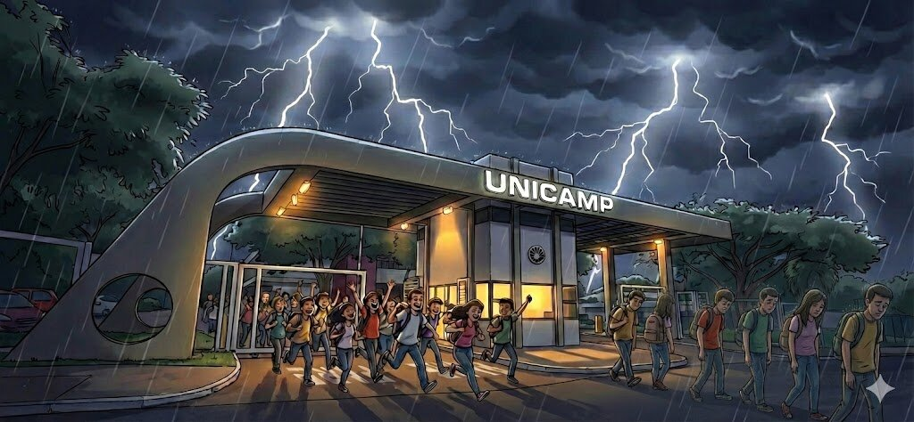

# Boas-Vindas, Bixo!

> Seja bem-vindo a uma das maiores universidades deste país. A gente te
> parabeniza de verdade — e, de todo “amor”, montou este manual pra você
> sofrer na universidade de um jeito um pouco mais amenizado. O tom é leve
> de propósito. Se você quer regulamento, a DAC resolve. Aqui é aluno
> falando com aluno.

## Você passou. Agora respira

Este manual não tem vínculo com organização nenhuma. É feito de estudante
pra estudante, com o que a gente conseguiu juntar de útil sem virar
apostila: serviço, burocracia, campus, macete de corredor. A ideia é você
se achar na primeira semana sem precisar perguntar a mesma coisa em três
grupos de Zap.

A gente leu os manuais antigos (CAT 2013, CDI 2024, edição 2026) e a vida
no campus, e reescreveu. O que entra aqui é o que ainda serve. Piada só
fica quando carrega informação; gente, a gente não zoa.

### O contrato deste gibi

Cada capítulo é uma edição. Tem sumário, virada de página e modo rolagem.
Daqui pra frente: cidade, campus, serviços, burocracia, organizações,
permanência, sobrevivência acadêmica, calourada, movimento estudantil e
uma lista de links pra quando for 23h59.

- Confirma a matrícula e a documentação no prazo do edital. Sumir do portal cancela a vaga.
- Ativa a senha no e-DAC cedo. E-mail @dac, Moodle, Workspace e Eduroam andam juntos.
- Baixa a carteirinha digital (app Serviços Unicamp) antes da primeira catraca do RU.
- Anota prazo de matrícula, rematrícula e bolsa. Data e valor saem do canal oficial.

## Unicamp e o susto de Limeira

Muita gente não olhou em qual campus estava o curso. Pensou que
universidade de Campinas só existiria em Campinas e só descobriu
**Limeira** na hora da matrícula. Se foi o teu caso, respira: você não é o
primeiro, e a cidade dá pra viver.

Seu curso é da **Faculdade de Tecnologia (FT)** — Campus 1, Rua Paschoal
Marmo, 1888, Jardim Nova Itália. Aula, lab, secretaria e bandeco da FT
ficam aqui. A FCA é outro campus, o Campus 2, a uns 850 m. Dá pra ir a pé
ou de bike, mas não é o endereço das suas aulas no primeiro dia. Anota
isso antes de seguir o GPS no desespero.

> “Unicamp Limeira” tem dois endereços. O seu, bixo da FT, é o Campus 1.
> Confunde uma vez; na segunda, já vale olhar o mapa com calma.

## Como ler

Este manual te dá vocabulário, prioridade e alguém do lado dizendo que tem
caminho. Ele não substitui edital, coordenação nem site de bolsa. Quando
a gente escrever “olha o oficial”, abre o site e confere: valor, prazo e
regra mudam de ano em ano. O macete de *onde* olhar é o que fica.

## Fechamento

Você vai errar prédio, horário e tom de e-mail. Faz parte. O resto deste
manual é mapa pra você errar menos, e com um pouco menos de susto.

> Come alguma coisa, acha o RU, e vai com calma. Entrar foi difícil.
> Permanecer é o trabalho de verdade — a gente escreveu o caminho com
> carinho e um pouco de ironia.
