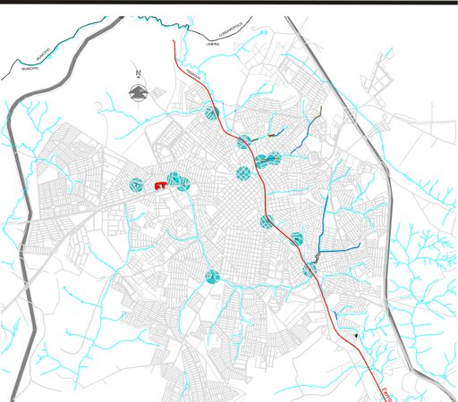
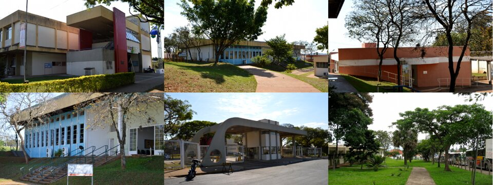

# A FT e a Unicamp

> Não olhou o campus no edital, achou que universidade de Campinas
> logicamente só existiria em Campinas, e ficou impressionado na matrícula
> quando viu “Limeira”? Respira. Abaixo: a cidade, a universidade e o campus
> — nessa ordem, pra você parar de se perder.

## Limeira: clima, água e cultura

Apresento Limeira, onde você vai passar por longos períodos de calor — seco e
úmido, as duas “estações” oficiais da região. A temperatura mínima gira em
torno dos 18 °C, então casaco pesado é mais status do que necessidade na maior
parte do ano. É zona de cultivo de cana: queimada e ar seco aparecem com
frequência; umidificador deixa de ser frescura e vira necessidade.
Outro detalhe pouco glamouroso: a drenagem da cidade não é das melhores. Em
chuva forte, pedaços do Centro e outras regiões alagam — vale olhar o mapa de
alagamentos de Limeira antes de escolher rota de bike ou imóvel “barato
demais perto do córrego”.

### Eventos e vida fora da sala

Tem agenda universitária (amigo, grupo, rep, org) e agenda da cidade: teatro
municipal, parque da cidade (hípica), eventos da prefeitura. A hípica costuma
ter programação com certa frequência — útil quando a FT estiver em modo
“sossego extremo” e você precisar lembrar que existe vida além do LP. Siga o
Instagram da cidade e a agenda oficial; o boca a boca resolve o resto.

- Confira o mapa de alagamentos antes da temporada de chuva.
- Siga ARULI / grupos de moradia e a agenda cultural da cidade.
- Na primeira semana, mapeie padaria, farmácia e mercado na Cônego Manuel Alves.

## Onde morar (sem romance)

Em Limeira dá pra montar vida de várias formas, e nenhuma é “a certa” pra
todo mundo. **Repúblicas** (femininas, masculinas, mistas) servem quem quer
conhecer gente e viver em comunidade — cada uma com cultura própria; o
Instagram da ARULI ajuda a vasculhar. **Kitnets** dão privacidade, em geral
com aluguel mais salgado. **Casas ou apartamentos compartilhados** são o
clássico “turma se junta, alguém tranca, abre vaga no grupo de moradia” —
quarto individual ou compartilhado, conforme o anúncio. **Pensões /
pensionatos**: muita gente aluga edícula ou quarto em casa; às vezes o dono
mora na frente, às vezes só estudante. Você aluga o quarto, divide área
comum, costuma ter bom custo-benefício… e não escolhe os colegas.

Ao longo do curso, muita gente **se afasta das reps** e busca lugar mais
quieto ou isolado — estágio, sono, ou só paz. Marketing de “rep = onde você
cresce” funciona pra alguns e é propaganda pra outros. Escolhe pelo que você
aguenta no semestre, não pelo reel.

### Lado FT × lado FCA × Centro

Lado FT (Vila Cristovam, Nova Itália, Vila Anita, Morro Azul): pé na portaria.
Lado FCA (Cidade Universitária, Chácara Antonieta): kitnet moderna + circular.
Centro: comércio e terminal; uns 15 min a pé subindo a Cônego.

### Macete

- Visite o imóvel de dia e de noite antes de assinar. Foto de anúncio mente.
- Pergunte o que está incluso (condomínio, IPTU, internet) e qual garantia exigem.
- Se for concorrer a auxílio-moradia, lê o edital DEAPE antes de fechar contrato.
- Planeje a moradia em fases: o que serve no 1º ano pode não servir no estágio.

## A universidade (pilares sem verniz)

A Unicamp é uma das maiores da América Latina e oferece um sistema completo:
bolsas, auxílios, eventos, extensão e pesquisa. Os pilares oficiais —
**extensão, docência e pesquisa** — não são slogan de folder: pra fechar a
graduação você precisa atravessar os três de algum jeito.

**Extensão** é a pedra no sapato clássica de quem é mais introvertido: cerca
de 10% da carga horária do curso em horas de extensão. Dá pra cumprir
ajudando ONG, entrando em projeto (com ou sem bolsa), ou pagando cursos tipo
Extecamp / Instituto Confúcio — útil, mas confirma carga e limite no teu
catálogo. Algumas matérias já dão hora de extensão; quase nunca o bastante
sozinhas. **Docência**, pro estudante comum, é fazer as matérias; pra quem
mira carreira acadêmica, um dia também é lecionar.
Quando a aula flertar com o caos, lembra: o professor é antes de tudo
pesquisador que também dá aula — e aí monitoria e PAD existem. **Pesquisa**:
CR e histórico importam; IC (PIBIC, PIBIT, voluntário, FAPESP) abre porta pra
mestrado. FAPESP paga mais e exige mais escopo (e mais página). Caminho
clássico de IC: professor com sinergia → conversa pré/pós aula → e-mail
demonstrando interesse → reunião. Sem medo de mandar o e-mail.

Horas **complementares** são outro pacote (em geral até menos de 20% da carga),
adquiridas por caminhos parecidos e **limitadas por categoria**. Não misture
extensão com complementar na cabeça — e consulta cedo quanto falta de cada
uma. Deixar tudo pra cima do estágio é pedir pra apertar o semestre sem
necessidade.

> Professor é pesquisador que por acaso leciona. Quando a didática falhar,
> lembra do cargo principal — e vai atrás de monitoria.

## O campus da FT

O campus da FT é ideal pra quem quer um pouco de sossego da vida universitária
“de novela”. O movimento é menor, o engajamento no dia a dia também — muita
gente fica refém de matérias cansativas o bastante pra não sobrar disposição
pra nada além da matéria. Se quiser mais agito, o caminho costuma passar por
FCA ou Barão. O campus divide espaço com o Cotil: você vai ver adolescente em
turma agitada, e a galera da FT culpa eles por tudo que quebra (com ou sem
prova). Observação prática: as **quadras** são deles; uso da galera da FT em
geral é de noite / combinado com atlética — pergunta antes de invadir treino.

Na FT rolam eventos de curso (Tecnologia em Foco, Semana da Engenharia e
afins) em que boa parte dos professores libera aula pra você participar.
Aproveita: é cultura, hora e desculpa oficial pra não ficar só no Moodle.

### Salas: PA, SA, LP

PA = anfiteatro. SA = sala teórica. LP = lab de programação (TIC). A FT tem
sistema de alocação de salas na intranet: busca código/horário e acha onde
cair de paraquedas no primeiro dia.

- No dia 1, vá só ao Campus 1 (FT). FCA não é “quase a mesma coisa”.
- Consulte alocação de salas antes de vagar pelo corredor fingindo confiança.
- Eduroam + e-mail DAC: configura no celular antes da aula que “só precisa de net”.

## Fechamento

Limeira não é castigo: é mapa (com alagamento e umidificador). FT não é Barão
em miniatura: é outro ritmo. Aprende endereço, clima e pilares — o resto do
manual encaixa em cima disso.

> A FT proverá energia, Wi-Fi e bandeco. Moradia e juízo, não.
