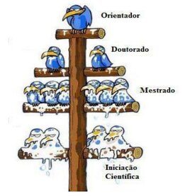

# Permanência Estudantil

> Permanecer na universidade também é dinheiro, pesquisa, estágio e saúde.
> Valor e edital mudam. Este capítulo te aponta o caminho; o site oficial
> fecha o número.

## Bolsas sociais

Existem auxílios de permanência — social, moradia, alimentação — via DEAPE
e outros canais da universidade. Este manual não é o melhor lugar pra
congelar valor: a regra fica mais rígida com o tempo, a faixa de renda
per capita muda, e além da entrevista pode haver visita em casa pra
comprovar a situação. O que não muda é o gesto: você precisa demonstrar,
com documento, que está precisando.

- Consulta a página oficial de bolsas, DEAPE e SAE na semana do edital.
- Em dúvida, pergunta na assistência estudantil ou pra quem já passou pelo processo no teu curso.
- Monta a inscrição em cima do edital vigente, não de PDF antigo de grupo.

## PIBIC, FAPESP e bolsa de extensão

Além da permanência social, tem bolsa de **pesquisa** e de **extensão**.
O pacote muda o quanto você pode acumular com estágio. Escolhe o ritmo
antes de assinar os dois.

### PIBIC

Bolsa de iniciação científica, CNPq ou institucional. Em geral **acumula
com estágio**: dá pra manter as duas frentes se o horário fechar. É a
porta clássica pra pesquisa sem te engolir a semana inteira.

### FAPESP

Bolsa mais robusta, com escopo e cobrança maiores. **Não acumula com
estágio**. Você fica dedicado à pesquisa: mais hora, mais entrega, menos
espaço pra um contrato paralelo. Entra se topa esse ritmo. FAPESP pede
mais página e mais projeto; o valor acompanha a cobrança.

### Bolsa de extensão

Costuma **acumular** com outras coisas e, no que a galera conta, paga
mais que a PIBIC. A vaga é escassa: precisa de sorte e de estar no
projeto certo na hora certa. Fica de olho em edital e em quem já está em
extensão.

> PIBIC e estágio, em geral, convivem. FAPESP é pesquisa em tempo quase
> integral. Extensão bem paga existe, e é rara. O edital do ano manda na
> combinação.

## Estágio cedo

Procura estágio o mais cedo que der. Se você é tímido, melhor ainda
começar já: entrevista, organização, extensão, qualquer coisa que te force
a falar, apresentar e treinar resposta. Quando o processo seletivo chegar
com a pergunta clássica, ela já está na ponta da língua.

- Manda um currículo curto e atualiza a cada semestre.
- Entra em algo que te faça treinar — organização, extensão, monitoria — antes do processo seletivo.
- Recusa faz parte. O músculo é tentar de novo.

## Duplo diploma

### Macete

- Se quer **duplo diploma**, começa cedo. O cronograma só aperta com o tempo.
- Entrou na **1ª ou 2ª chamada**? Dá pra tentar alterar a matrícula e já incluir matéria do segundo curso no primeiro semestre. Fazer duas graduações ao mesmo tempo é pra poucos, e quanto mais cedo, menos impossível.
- A demanda em matérias de **TADS e BSI** anda alta; coordenação costuma barrar. Depende muito de quem está na coordenação no teu semestre.
- Mantém o **CR alto**. Ele é critério de desempate quando você disputa disciplina extracurricular ou vaga apertada.

Confirma regra e vaga com a coordenação do curso. Este macete não
substitui o “pode” oficial do semestre.

## SAE, SAPPE e saúde

Permanência também é acolhimento. O SAPPE existe pra psicologia e
psiquiatria. O CECOM resolve o agudo leve. Emergência pesada é hospital.
Pedir ajuda faz parte do caminho, no mesmo espírito de quem pede bolsa:
você usa o serviço que a universidade mantém pra isso.

> Se precisa de atendimento, usa. Carregar tudo sozinho costuma sair mais caro.

## Fechamento

Bolsa social: site oficial, documento em dia, edital do ano. Pesquisa:
escolhe o ritmo — PIBIC mais flexível, FAPESP mais devota, extensão se a
vaga aparecer. Estágio e duplo diploma: cedo. Saúde: sem adiar.

- Antes de qualquer inscrição, abre o edital vigente. Este capítulo aponta a porta; o edital diz se ela está aberta.
